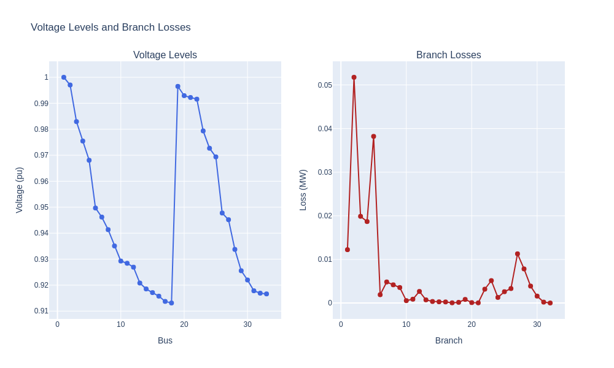
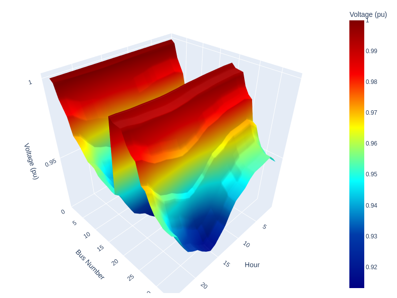
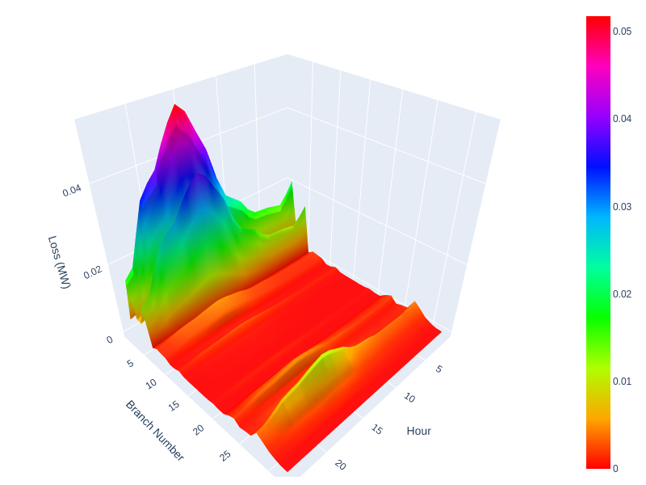
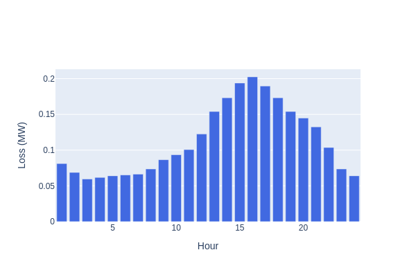

<!DOCTYPE html>
<html>

<body>
    <h1>Load Flow Analysis with Jupyter</h1>
    
 This repository offers a Jupyter implementation of Load Flow Analysis with the Newton-Raphson technique. This resource can be helpful for undergraduate researchers intending to incorporate various machine learning or robust optimization techniques with power flow analysis..

  <h2>Features</h2>
    <ul>
        <li>Load flow analysis using Newton-Raphson Method</li>
        <li>Can be used for integration with machine learning/optimization techniques</li>
<li> IEEE 33-bus distribution system </li>
        <li>Visual representation of results including voltage profiles, branch losses, and power loss curves</li>
    </ul>

   <h2>Figures</h2>
   <h3>1. Voltage Levels and Branch Losses (Peak Hour)</h3>
    

  <h3>2. Voltage Levels Across Buses (24 Hours) </h3>
    
   <h3>3. Branch Losses (24 Hours)</h3>
    
<h3>4. Hourly Power Loss </h3>
    

</body>
</html>
